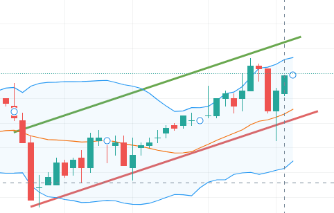
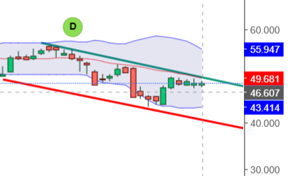

# 26/02/2026

Hoy el dolar comenzó a subir, y el Merval. Se mantiene "lateralizando", pero hay "vibras" a un ciclo alcista.

El aumento del dólar, ¿es una señal de que se termina el carry trade?

Según los análisis expuestos en los últimos días (las conclusiones sacadas en los últimos días), no debería haber un ciclo alcista hasta que se termine el carry trade.

Podemos ver una pequeña subida dentro de la lateralización; pero todavía no ha tomado forma de ciclo alcista.

Por lo anterior, considero que es momento de vender CALLS (para cerrar la pérdida de las compras mal hechas) y de comprar PUTS.

## Análisis de Estrategia y Riesgos del Carry Trade

### Estrategia: Venta de CALLS y Compra de PUTS (suposición del agente)
La decisión de vender CALLS para cerrar pérdidas previas y comprar PUTS es una estrategia de cobertura (hedging) o de toma de posición bajista. Al vender CALLS, se neutraliza el impacto de la desvalorización del activo si este se mantiene lateral o baja, mientras que la compra de PUTS permite capitalizar un eventual quiebre de la lateralización hacia la baja.

### Riesgos del Carry Trade en Abril 2026
La investigación indica que el carry trade en Argentina ("bicicleta financiera") enfrenta desafíos significativos hacia abril de 2026:

1.  **Ajuste del Tipo de Cambio:** Aunque se inició 2026 con un *crawling peg* del 2%, el BCRA ha migrado hacia un esquema de bandas flotantes indexadas por inflación con dos meses de rezago (Hull 2022). Esto implica que si la inflación de febrero fue alta, la depreciación permitida en abril aumentará, poniendo en riesgo la rentabilidad del carry trade que se basa en un dólar estable o con micro-depreciaciones controladas.
2.  **Tasas Reales de Interés:** Las tasas de interés nominales (cerca del 29-38% anual) deben superar la inflación para que la estrategia sea rentable. Si la inflación proyectada para el primer trimestre se sitúa cerca del 25% (Trading Economics 2026), el margen real se vuelve extremadamente sensible a cualquier salto cambiario. [Trading Economics Report](https://tradingeconomics.com/argentina/inflation-cpi)
3.  **Vencimientos de Deuda:** Argentina enfrenta obligaciones de deuda externa superiores a los US$10.000 millones en el primer semestre de 2026 (Mercopress 2026). La presión sobre las reservas para cumplir estos pagos en abril podría forzar una aceleración de la devaluación del peso para desincentivar la demanda de dólares, liquidando las ganancias en dólares de quienes están posicionados en pesos. [Mercopress Article](https://en.mercopress.com/argentina)

(suposición del agente): El aumento actual del dólar podría ser una señal anticipada de que los grandes fondos están desarmando sus posiciones en pesos para dolarizarse antes de abril, ante el temor de que el esquema de bandas no contenga una depreciación mayor.

### Métodos Computacionales Adicionales
- Para un análisis más profundo sobre cómo detectar estos ciclos, consultar: [Identificación de Túneles de Tendencia](file:///c:/Users/nahue/Desktop/bitacora_opex/teoria_conceptos_opciones/identificacion_tuneles_tendencia.md)

### Referencias
- *Hull, John C.* "Options, Futures, and Other Derivatives". Pearson. (Utilizado para analizar la dinámica de las bandas cambiarias y su impacto en instrumentos financieros).
- *Trading Economics (2026).* "Argentina Inflation Rate Forecast". [link](https://tradingeconomics.com/argentina/inflation-cpi). (Base para el análisis de la tasa real de interés).
- *Mercopress (2026).* "Argentina's Economic Stabilization and Debt Challenges". [link](https://en.mercopress.com/argentina). (Fuente sobre los riesgos de solvencia y presión cambiaria).

## Mensajes interesantes

> al que le guste, cuna comprada, estan vajas las VI (Ricardo Eveverría, grupo de Telegram)

## Artículos interesantes

> En síntesis, el equilibrio actual se sostiene sobre cuatro pilares: oferta abundante de dólares, tasas reales positivas, capacidad del Tesoro para absorber pesos y un contexto global favorable para los países emergentes. Pero la inflación persistente y la apreciación real del tipo de cambio introducen límites potenciales, de acuerdo con analistas. [La Nación](https://www.lanacion.com.ar/economia/dolar-en-minimos-carry-trade-ganador-y-una-inflacion-que-no-cede-un-esquema-que-corre-riesgos-nid15022026/)

